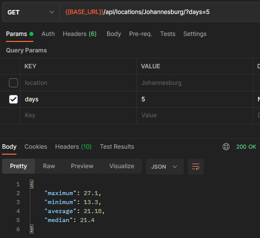
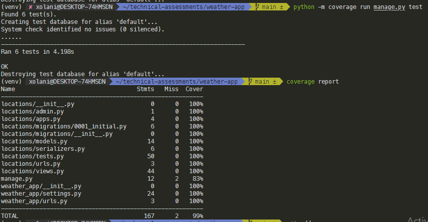
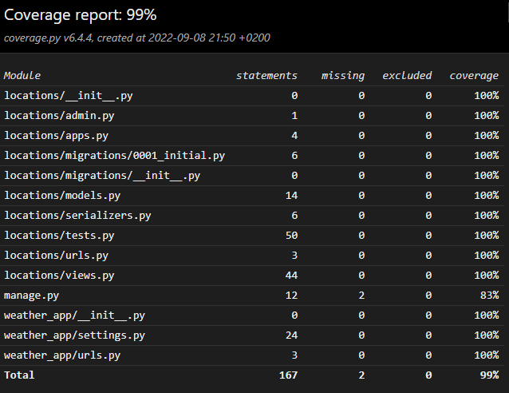

# Weather-App
Django App using the Weather API

## Usage

* Install and create virtualenv

```bash
python install virtualenv
virtualenv venv
```

* Activate virtualenv and install dependencies

```bash
for Linux and Mac:
source venv/bin/activate

for Windows
/venv/Scripts/activate

pip install -r requirements.txt
```

>SQLITE3 database is used for this project for easy testing. But PostgreSQL, MySQL etc. is recommended for production.

* Add a file called `.env` in the root folder with your Django and WeatherAPI credentials in the file:

```bash
SECRET_KEY = 'django-insecure-_your_secret_key'
API_KEY = "your_key"
```

Look at the `.env.example` file for reference.

>Please note I added the keys in the .env.example file for easy testing. But in a real world scenario, you should not do this.

* Run Django on your local server.

```bash
python manage.py collectstatic
python manage.py migrate
python manage.py runserver
```

* Open http://127.0.0.1:8000/{location}/?days={days} in your browser, Postman or your API testing tool.

Example:


## Testing

1. Before running tests, make sure you have installed the dependencies. (These are included in the requirements file)

```bash
pip install -r requirements.txt
```

2. Run coverage to run the tests

```bash
coverage run manage.py test
```

3. Run coverage report to see coverage in terminal or in your browser

```bash
coverage report
```



```bash
coverage html
open ./htmlcov/index.html
```


